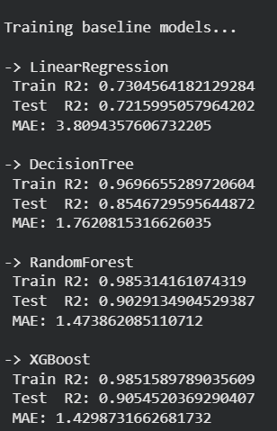

# 🚕 Taxi Trip Duration Prediction

Predicts taxi trip duration using Machine Learning models.

## Models Used
- Linear Regression
- Decision Tree
- Random Forest
- XGBoost
- Extra Trees
- MLP

## 📊 Results

| Model | MAE | R² |
|------|-----|----|
| Linear Regression | 3.81 | 0.72 |
| Random Forest | 1.47 | 0.90 |
| XGBoost | **1.43** | **0.91** |

📌 XGBoost achieved the best performance.

## Dataset
Dataset not included due to size limits.

Download from:
https://www.nyc.gov/site/tlc/about/tlc-trip-record-data.page

Place as:
data/combined_ML_data.csv

## Run
pip install -r requirements.txt
python src/train_models.py

## Author
Brijesh Shetty N.
